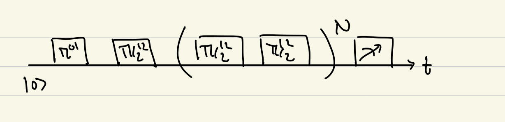

# The paper's story (from `paper/story.ipynb`, Jan 2025)

*Verbatim notes of the author, images re-linked to this repository.*

# High fidelity control of a superconducting qutrit

## Context

People want to control superconducting qutrits with high fidelity.

## Problematic

1. The presence of another computational state, $|2\rangle$, introduces two more error sources, namely virtual and real (leakage) transitions within and out of the computational subspace.
2. Extending qubit-like calibration methods do not capture the effect introduced by the presence of new error sources.
3. Logical errors associated with different precession rates in each qutrit's subspace, resulting in non-trivial dynamical phases, called "phase advance".

## Methodology

### Characterization of error sources

To illustrate the fact that extending qubit-like calibration methods do not capture the effect introduced by the presence of new errors source, let us look at the coherent error amplifying sequence for a $\pi/2$ pulse on the (12) subspace. The sequence is described as below. The pulse used was a Gaussian pulse with amplitude calibrated by the Rabi experiment.

The sequence boosts sensitivity to over/under-rotation errors. It was not designed to detect phase errors. 

Here's the result

In this case, the error is over-rotation. $\pi/2+\epsilon$. To extract the over-rotated angle $\epsilon$, we have two methods. First, we use a master-equation-based model to extract $\epsilon$. Here's the result.

From the plot, $\epsilon/(\pi/2)\approx 3.7$%. We have another model, termed "heuristic model", because it's a guess. It assumes the qutrit takes on the dynamics of a spin-1/2 particle in a oscillating external field, $H=(\frac{\pi}{2}+\epsilon)\sigma_x + \delta\sigma_z$, where $\delta$ represents the aggregate effect of phase errors. Here's the result.

From the plot, $\epsilon/(\pi/2)\approx 2.7$%. We **therefore** have a difference to settle.
